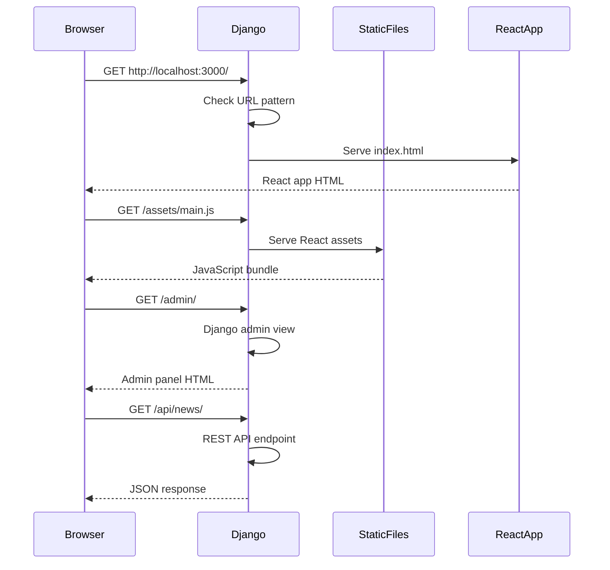

# Design Document: Django Serve React Frontend

## Overview

Configure Django backend to serve React frontend on a single port (3000), where Django handles both the React app and admin panel. This eliminates the need for separate development servers and provides a unified deployment architecture.

## Architecture

```mermaid
graph TD
    A[Client Browser] --> B[Django Server :3000]
    B --> C{Route Handler}
    C -->|/admin/*| D[Django Admin Panel]
    C -->|/api/*| E[Django REST API]
    C -->|/static/*| F[Django Static Files]
    C -->|/media/*| G[Django Media Files]
    C -->|/assets/*| H[React Static Assets]
    C -->|/* (all other)| I[React Frontend]
    
    I --> J[React Router]
    J --> K[React Components]
    
    F --> L[Django Admin CSS/JS]
    H --> M[React Build Assets]
    
    style B fill:#e1f5fe
    style D fill:#f3e5f5
    style E fill:#e8f5e8
    style I fill:#fff3e0
```

## Sequence Diagrams

### Main Request Flow



## Components and Interfaces

### Component 1: Django URL Configuration

**Purpose**: Route requests to appropriate handlers (admin, API, static files, React frontend)

**Interface**:
```python
urlpatterns = [
    path('admin/', admin.site.urls),
    path('api/', include('api.urls')),
    re_path(r'^assets/(?P<path>.*)$', serve_react_assets),
    re_path(r'^(?!admin|api|static|media).*$', IndexView.as_view()),
]
```

**Responsibilities**:
- Route admin requests to Django admin
- Route API requests to REST endpoints
- Serve React static assets from /assets/
- Serve React frontend for all other routes

### Component 2: Django Settings Configuration

**Purpose**: Configure Django to serve React build files and run on port 3000

**Interface**:
```python
TEMPLATES = [{
    'DIRS': [BASE_DIR.parent / 'frontend' / 'dist'],
}]

STATICFILES_DIRS = [
    BASE_DIR.parent / 'frontend' / 'dist' / 'assets'
]
```

**Responsibilities**:
- Point Django templates to React build directory
- Configure static files to include React assets
- Set up CORS for API access
- Configure port 3000 for Django server

### Component 3: React Frontend Configuration

**Purpose**: Configure React to work with Django backend on same port

**Interface**:
```typescript
export const API_BASE_URL = isDevelopment
  ? (import.meta.env.VITE_API_URL || 'http://localhost:8000/api')
  : '/api';
```

**Responsibilities**:
- Use relative API URLs in production
- Handle development vs production API endpoints
- Build to Django-compatible directory structure

### Component 4: IndexView Template Handler

**Purpose**: Serve React index.html for non-admin/API routes

**Interface**:
```python
class IndexView(TemplateView):
    template_name = 'index.html'
```

**Responsibilities**:
- Serve React index.html template
- Handle client-side routing fallback
- Disable caching for development

## Data Models

### Django Server Configuration

```python
SERVER_CONFIG = {
    'port': 3000,
    'host': '0.0.0.0',
    'debug': True,
    'static_root': Path('backend/staticfiles'),
    'media_root': Path('backend/media'),
    'react_build_dir': Path('frontend/dist')
}
```

**Validation Rules**:
- Port must be available (3000)
- React build directory must exist
- Static files must be collected

### URL Routing Configuration

```python
ROUTE_PATTERNS = {
    'admin': r'^admin/',
    'api': r'^api/',
    'static': r'^static/',
    'media': r'^media/',
    'assets': r'^assets/',
    'react_fallback': r'^(?!admin|api|static|media).*$'
}
```

**Validation Rules**:
- Admin routes take precedence
- API routes must be protected
- React fallback must be last pattern

## Algorithmic Pseudocode

### Main Server Configuration Algorithm

```pascal
ALGORITHM configureUnifiedServer()
INPUT: django_settings, react_build_path
OUTPUT: configured_server

BEGIN
  ASSERT react_build_path.exists() = true
  ASSERT django_settings.port = 3000
  
  // Step 1: Configure Django templates
  django_settings.TEMPLATES[0].DIRS.add(react_build_path)
  
  // Step 2: Configure static files
  assets_path ← react_build_path / 'assets'
  IF assets_path.exists() THEN
    django_settings.STATICFILES_DIRS.add(assets_path)
  END IF
  
  // Step 3: Configure URL patterns with priority order
  url_patterns ← []
  url_patterns.add(admin_urls)  // Highest priority
  url_patterns.add(api_urls)
  url_patterns.add(static_urls)
  url_patterns.add(media_urls)
  url_patterns.add(react_assets_urls)
  url_patterns.add(react_fallback_url)  // Lowest priority
  
  // Step 4: Configure CORS for API access
  django_settings.CORS_ALLOWED_ORIGINS.add('http://localhost:3000')
  
  ASSERT all_patterns_configured(url_patterns) = true
  
  RETURN configured_server
END
```

**Preconditions**:
- React frontend is built (frontend/dist exists)
- Django project is properly configured
- Port 3000 is available

**Postconditions**:
- Django serves on port 3000
- All routes are properly configured
- React app is accessible at root URL
- Admin panel is accessible at /admin/

**Loop Invariants**:
- URL patterns maintain priority order throughout configuration
- Static file directories remain valid throughout setup

### Request Routing Algorithm

```pascal
ALGORITHM routeRequest(request_url)
INPUT: request_url of type String
OUTPUT: response_handler of type Handler

BEGIN
  // Check patterns in priority order
  IF request_url MATCHES '^/admin/' THEN
    RETURN django_admin_handler
  END IF
  
  IF request_url MATCHES '^/api/' THEN
    RETURN django_api_handler
  END IF
  
  IF request_url MATCHES '^/static/' THEN
    RETURN django_static_handler
  END IF
  
  IF request_url MATCHES '^/media/' THEN
    RETURN django_media_handler
  END IF
  
  IF request_url MATCHES '^/assets/' THEN
    RETURN react_assets_handler
  END IF
  
  // Default fallback to React frontend
  RETURN react_index_handler
END
```

**Preconditions**:
- request_url is a valid URL string
- All handlers are properly initialized

**Postconditions**:
- Returns appropriate handler for the request
- React frontend handles client-side routing
- Admin and API routes are protected

**Loop Invariants**:
- Pattern matching follows priority order
- Fallback handler is always available

## Key Functions with Formal Specifications

### Function 1: configureReactServing()

```python
def configureReactServing(settings, react_build_path: Path) -> None
```

**Preconditions:**
- `settings` is a valid Django settings module
- `react_build_path` exists and contains built React app
- `react_build_path / 'index.html'` exists

**Postconditions:**
- Django TEMPLATES configured to serve React index.html
- STATICFILES_DIRS includes React assets directory
- URL patterns configured for React routing fallback

**Loop Invariants:** N/A (no loops in function)

### Function 2: setupUnifiedPort()

```python
def setupUnifiedPort(port: int = 3000) -> None
```

**Preconditions:**
- `port` is a valid port number (1024-65535)
- Port is not already in use
- Django settings allow port configuration

**Postconditions:**
- Django development server configured to run on specified port
- CORS settings updated for the new port
- All URL patterns accessible on the unified port

**Loop Invariants:** N/A (no loops in function)

### Function 3: validateConfiguration()

```python
def validateConfiguration(settings) -> bool
```

**Preconditions:**
- `settings` is a Django settings object
- React build directory path is configured

**Postconditions:**
- Returns `True` if configuration is valid
- Returns `False` if any required files/directories are missing
- No side effects on settings object

**Loop Invariants:**
- For validation loops: All previously checked components remain valid

## Example Usage

```python
# Django settings configuration
TEMPLATES = [
    {
        'BACKEND': 'django.template.backends.django.DjangoTemplates',
        'DIRS': [BASE_DIR.parent / 'frontend' / 'dist'],
        'APP_DIRS': True,
        'OPTIONS': {
            'context_processors': [
                'django.template.context_processors.debug',
                'django.template.context_processors.request',
                'django.contrib.auth.context_processors.auth',
                'django.contrib.messages.context_processors.messages',
            ],
        },
    },
]

# Static files configuration
frontend_assets = BASE_DIR.parent / 'frontend' / 'dist' / 'assets'
STATICFILES_DIRS = [frontend_assets] if frontend_assets.exists() else []

# URL patterns
urlpatterns = [
    path('admin/', admin.site.urls),
    path('api/', include('api.urls')),
    re_path(r'^assets/(?P<path>.*)$', serve, {
        'document_root': BASE_DIR.parent / 'frontend' / 'dist' / 'assets',
    }),
    re_path(r'^(?!admin|api|static|media).*$', IndexView.as_view()),
]

# Running the server
python manage.py runserver 0.0.0.0:3000
```

```typescript
// React configuration for unified server
const isDevelopment = import.meta.env.DEV;
export const API_BASE_URL = isDevelopment
  ? 'http://localhost:8000/api'  // Separate dev server
  : '/api';  // Unified production server

// Build command for production
npm run build  // Builds to frontend/dist
```

## Correctness Properties

### Universal Quantification Statements

1. **Route Priority Property**: ∀ request ∈ Requests, admin_routes ∪ api_routes have higher priority than react_fallback_route
2. **Static File Serving Property**: ∀ asset ∈ ReactAssets, asset is accessible via /assets/ prefix when served by Django
3. **API Accessibility Property**: ∀ endpoint ∈ APIEndpoints, endpoint remains accessible at /api/ prefix regardless of frontend routing
4. **Admin Panel Property**: ∀ admin_url ∈ AdminURLs, admin_url is accessible at /admin/ prefix without interference from React routing
5. **Client-Side Routing Property**: ∀ react_route ∈ ReactRoutes, react_route falls back to index.html for client-side handling

### Invariant Properties

1. **Port Consistency**: Django server and React app both accessible on port 3000
2. **Asset Integrity**: All React build assets remain accessible after Django configuration
3. **API Functionality**: All existing API endpoints continue to work without modification
4. **Admin Functionality**: Django admin panel remains fully functional
5. **Development vs Production**: Configuration works in both development and production modes

## Error Handling

### Error Scenario 1: React Build Not Found

**Condition**: Frontend build directory (frontend/dist) does not exist
**Response**: Django serves 404 for React routes, admin/API still work
**Recovery**: Run `npm run build` in frontend directory, restart Django server

### Error Scenario 2: Port 3000 Already in Use

**Condition**: Another process is using port 3000
**Response**: Django server fails to start with port binding error
**Recovery**: Kill process using port 3000 or use alternative port with updated CORS settings

### Error Scenario 3: Static Files Not Found

**Condition**: React assets directory missing or misconfigured
**Response**: React app loads but styling/JavaScript fails
**Recovery**: Verify STATICFILES_DIRS configuration and run collectstatic if needed

### Error Scenario 4: CORS Issues

**Condition**: API requests fail due to CORS policy
**Response**: Browser blocks API requests from React frontend
**Recovery**: Update CORS_ALLOWED_ORIGINS to include http://localhost:3000

## Testing Strategy

### Unit Testing Approach

Test individual components of the configuration:
- URL pattern matching and priority
- Static file serving functionality
- Template rendering for React index.html
- CORS configuration validation

**Key Test Cases**:
- Admin URLs route to Django admin
- API URLs route to REST endpoints
- Unknown URLs route to React frontend
- Static assets are served correctly

### Property-Based Testing Approach

**Property Test Library**: Django's built-in TestCase with hypothesis for property generation

**Properties to Test**:
1. Route priority consistency across different URL patterns
2. Static file accessibility for various asset types
3. API endpoint availability under different configurations
4. React routing fallback behavior for arbitrary paths

### Integration Testing Approach

End-to-end testing of the unified server:
- Start Django server on port 3000
- Verify React app loads at root URL
- Verify admin panel accessible at /admin/
- Verify API endpoints work from React frontend
- Test client-side routing with browser navigation

## Performance Considerations

- **Static File Serving**: Django serves React assets directly, may be slower than dedicated web server in production
- **Template Caching**: Disable caching for index.html in development to allow hot reloading
- **Asset Optimization**: Ensure React build is optimized (minified, compressed)
- **Database Queries**: API endpoints should use proper pagination and filtering

## Security Considerations

- **CORS Configuration**: Restrict CORS origins to specific domains in production
- **Static File Security**: Ensure React build doesn't expose sensitive information
- **Admin Panel Security**: Django admin remains protected by authentication
- **API Security**: Maintain existing API authentication and authorization

## Dependencies

- **Django**: Web framework for backend server
- **React**: Frontend framework (built to static files)
- **Vite**: Build tool for React frontend
- **django-cors-headers**: CORS handling for API requests
- **Node.js/npm**: For building React frontend