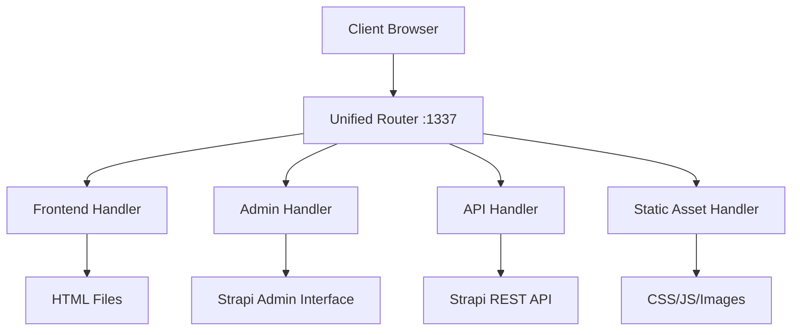
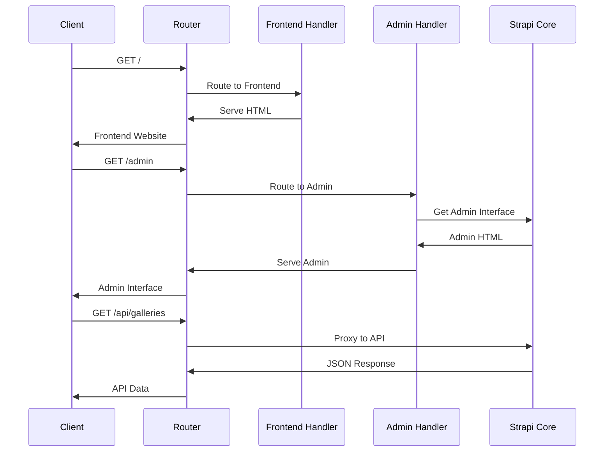

# Design Document: Unified Frontend Routing System

## Overview

This design implements a unified routing system that serves both the community website frontend and Strapi admin interface through a single port (1337). The system uses custom Strapi middleware and route handlers to provide clean URL routing while maintaining full functionality of both interfaces.

The architecture leverages Strapi's existing middleware system and adds custom routing logic to handle the dual-serving requirements. The frontend will be served at the root path (`/`) while the admin interface will be accessible at the standard `/admin` path.

## Architecture

### High-Level Architecture



### Request Flow



## Components and Interfaces

### 1. Custom Middleware Component

**File**: `backend/src/middlewares/unified-router.ts`

**Purpose**: Main routing logic that intercepts requests and directs them to appropriate handlers.

**Interface**:
```typescript
interface UnifiedRouterConfig {
  frontendPath: string;
  adminPath: string;
  staticPaths: string[];
  fallbackToFrontend: boolean;
}

interface RouteHandler {
  (ctx: Context, next: Next): Promise<void>;
}
```

**Responsibilities**:
- Route resolution based on URL patterns
- Request preprocessing and header management
- Error handling and fallback logic
- Static asset serving coordination

### 2. Frontend Handler Component

**File**: `backend/src/handlers/frontend-handler.ts`

**Purpose**: Serves the community website HTML and handles frontend-specific routing.

**Interface**:
```typescript
interface FrontendHandler {
  serveFrontend(ctx: Context): Promise<void>;
  serveStaticAsset(ctx: Context, assetPath: string): Promise<void>;
}
```

**Responsibilities**:
- Serve main HTML file for the community website
- Handle client-side routing fallbacks (SPA support)
- Manage static asset serving with proper MIME types
- Set appropriate caching headers

### 3. Admin Proxy Component

**File**: `backend/src/handlers/admin-handler.ts`

**Purpose**: Proxies requests to Strapi's built-in admin interface at the standard `/admin` path.

**Interface**:
```typescript
interface AdminHandler {
  proxyToAdmin(ctx: Context): Promise<void>;
  rewriteAdminUrls(html: string): string;
}
```

**Responsibilities**:
- Proxy requests to Strapi admin at `/admin`
- Maintain standard admin URL structure
- Preserve admin authentication and session handling
- Handle admin API calls and asset requests

### 4. Static Asset Manager

**File**: `backend/src/handlers/static-handler.ts`

**Purpose**: Efficiently serves static assets with proper caching and compression.

**Interface**:
```typescript
interface StaticHandler {
  serveAsset(ctx: Context, filePath: string): Promise<void>;
  getContentType(extension: string): string;
  shouldCompress(contentType: string): boolean;
}
```

**Responsibilities**:
- Serve CSS, JavaScript, and image files
- Apply appropriate compression (gzip/brotli)
- Set caching headers based on asset type
- Handle 404s for missing assets

## Data Models

### Route Configuration Model

```typescript
interface RouteConfig {
  pattern: RegExp;
  handler: RouteHandler;
  priority: number;
  methods: string[];
}

interface RoutingTable {
  routes: RouteConfig[];
  defaultHandler: RouteHandler;
  errorHandler: (ctx: Context, error: Error) => Promise<void>;
}
```

### Request Context Extensions

```typescript
interface ExtendedContext extends Context {
  routeInfo: {
    matchedPattern: string;
    handler: string;
    isStatic: boolean;
    originalPath: string;
  };
  frontendConfig: {
    buildPath: string;
    indexFile: string;
    staticPaths: string[];
  };
}
```

## Correctness Properties

*A property is a characteristic or behavior that should hold true across all valid executions of a system-essentially, a formal statement about what the system should do. Properties serve as the bridge between human-readable specifications and machine-verifiable correctness guarantees.*

<function_calls>
<invoke name="prework">
<parameter name="featureName">unified-frontend-routing

### Property Reflection

After analyzing all acceptance criteria, I identified several areas where properties can be consolidated:

- Properties 1.2, 4.1, 4.2, 4.3 can be combined into a comprehensive static asset serving property
- Properties 1.3, 5.1, 5.3, 5.4 can be combined into a comprehensive API proxying property  
- Properties 2.1, 2.2, 2.5 can be combined into a comprehensive admin interface property
- Properties 7.1, 7.2, 7.4 can be combined into a comprehensive error handling and logging property

### Correctness Properties

Property 1: Root path serves frontend
*For any* HTTP GET request to the root path `/`, the router should return HTML content with Content-Type header set to `text/html`
**Validates: Requirements 1.1**

Property 2: Static asset serving integrity
*For any* static asset request (CSS, JS, images), the router should serve the asset with the correct MIME type, appropriate caching headers, and optional compression
**Validates: Requirements 1.2, 4.1, 4.2, 4.3, 4.5**

Property 3: API proxying preservation
*For any* API request to `/api/*`, the router should proxy the request to Strapi, preserve all headers and authentication tokens, and return the exact response from Strapi
**Validates: Requirements 1.3, 5.1, 5.3, 5.4**

Property 4: Admin interface accessibility
*For any* request to `/admin/*`, the router should serve the Strapi admin interface with all functionality preserved, including authentication and session management
**Validates: Requirements 2.1, 2.2, 2.3, 2.4, 2.5**

Property 5: Route fallback behavior
*For any* request that doesn't match `/admin*` or `/api*` patterns, the router should serve the frontend website as the default response
**Validates: Requirements 3.5**

Property 6: Admin route serving
*For any* request to `/admin`, the router should serve the Strapi admin interface directly
**Validates: Requirements 3.2**

Property 7: Parameter preservation
*For any* request with URL parameters or query strings, the router should preserve them when routing to the appropriate handler
**Validates: Requirements 3.3**

Property 8: Error handling with stability
*For any* routing error or system failure, the router should log detailed error information, return meaningful error messages to users, and continue serving other routes without system-wide failure
**Validates: Requirements 7.1, 7.2, 7.3, 7.5**

Property 9: CORS header compliance
*For any* cross-origin request, the router should return appropriate CORS headers that allow the request to succeed
**Validates: Requirements 5.2**

Property 10: Configuration adaptability
*For any* change in environment variables or configuration, the router should adapt its behavior accordingly without requiring a restart
**Validates: Requirements 6.3, 6.4**

## Error Handling

### Error Categories

1. **Route Resolution Errors**
   - Invalid URL patterns
   - Missing route handlers
   - Circular redirect detection

2. **Static Asset Errors**
   - File not found (404)
   - Permission denied (403)
   - Corrupted files

3. **API Proxy Errors**
   - Strapi backend unavailable
   - Authentication failures
   - Network timeouts

4. **Admin Interface Errors**
   - Admin service unavailable
   - Session expiration
   - Permission denied

### Error Response Strategy

```typescript
interface ErrorResponse {
  status: number;
  message: string;
  details?: any;
  timestamp: string;
  requestId: string;
}
```

**Error Handling Flow**:
1. Catch and classify error type
2. Log error with context and request details
3. Return appropriate HTTP status code
4. Provide user-friendly error message
5. Maintain system stability for other requests

### Graceful Degradation

- If frontend assets fail to load, serve basic HTML with inline styles
- If admin interface is unavailable, show maintenance page with retry option
- If API proxy fails, return cached responses when available
- Log all degradation events for monitoring

## Testing Strategy

### Dual Testing Approach

The system will use both unit tests and property-based tests for comprehensive coverage:

**Unit Tests**: Focus on specific examples, edge cases, and integration points
- Test specific route patterns and handlers
- Test error conditions and edge cases
- Test middleware integration with Strapi
- Test configuration loading and validation

**Property Tests**: Verify universal properties across all inputs
- Test route resolution across random URL patterns
- Test static asset serving with various file types
- Test API proxying with different request types
- Test error handling with various failure scenarios

### Property-Based Testing Configuration

- **Testing Library**: fast-check (for TypeScript/Node.js)
- **Minimum Iterations**: 100 per property test
- **Test Tagging**: Each property test references its design document property

**Example Property Test Structure**:
```typescript
// Feature: unified-frontend-routing, Property 1: Root path serves frontend
test('root path always serves frontend HTML', () => {
  fc.assert(fc.property(
    fc.webUrl(), // Generate various URL variations
    async (url) => {
      const response = await request(app).get('/');
      expect(response.headers['content-type']).toContain('text/html');
      expect(response.status).toBe(200);
    }
  ), { numRuns: 100 });
});
```

### Integration Testing

- Test complete request flows from client to backend
- Verify frontend and admin interfaces work end-to-end
- Test deployment scenarios (development vs production)
- Performance testing under load

### Testing Environment Setup

- Mock Strapi backend for isolated testing
- Test data fixtures for consistent testing
- Automated testing in CI/CD pipeline
- Load testing for performance validation